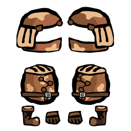
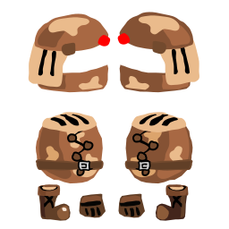

# glubglub
Convert old ItsyRealm source assets into a ready-to-edit post-processing friendly assets.

## Usage
Pretty simple usage:

```sh
python -m venv venv
source venv/bin/activate
python glubglub.py example/itsy.svg output.svg
```

So a picture is worth a thousand words...

### Source image


### Output image


## Troubleshooting

**Help! The output is all messed up!**

Open the source SVG in Illustrator. Ungroup everything. Save. Try again. Usually works.

**Something is solid red!**

`glubglub` couldn't figure out the outline clipping (probably). This happens if different "things" are layered incorrectly, like say the plume of a helmet is below the outline of the helmet itself and above all the fill/inside linework of the helmet. Just manually fix it!

**The program is super slow!**

Well, it's only meant to be run maybe once per asset. Ever. Ok, maybe twice if the output is all messed up. It still saves dozens of hours of going through the boring process of clipping a thousnad images... And hey, if you're not me, why are you using it